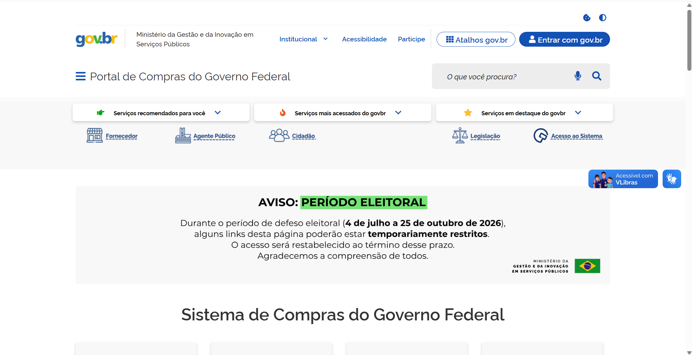
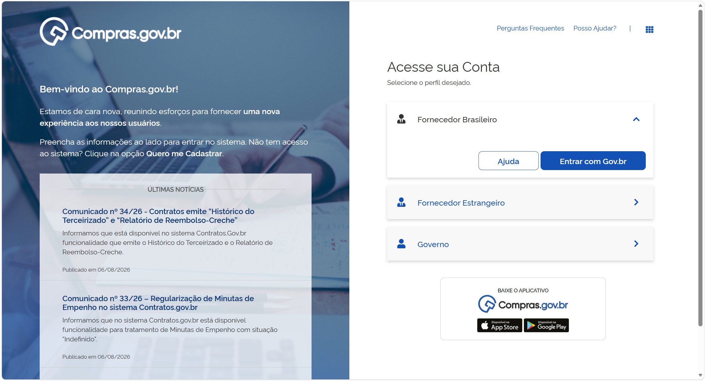
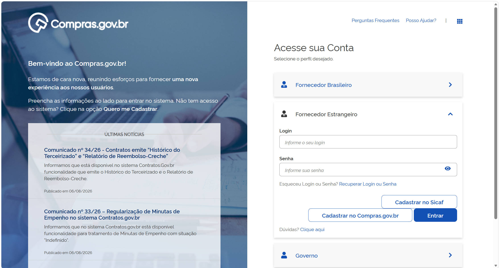
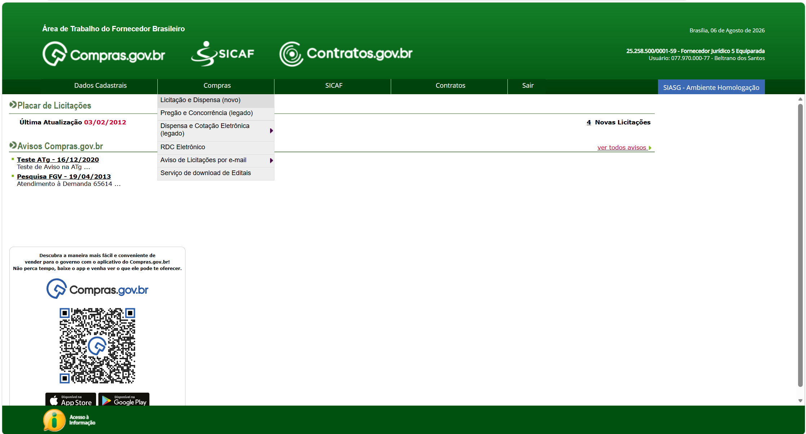
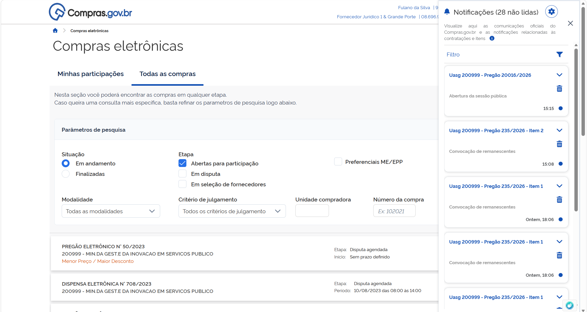
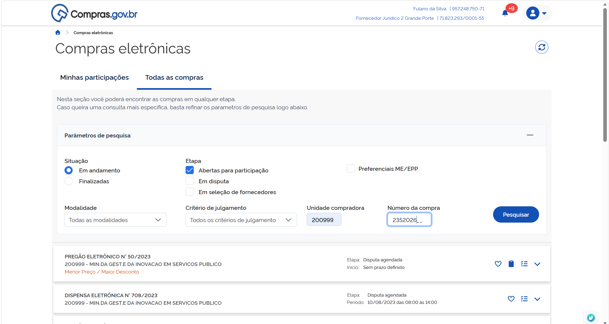
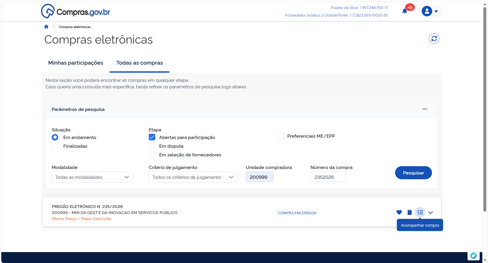
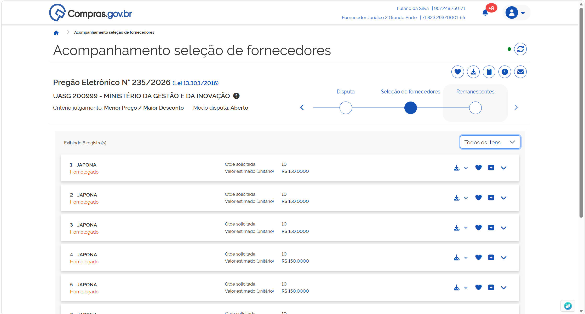

  <button onclick="window.print()" style="background-color: #0056b3; color: white; padding: 10px 20px; border: none; border-radius: 5px; font-size: 16px; cursor: pointer; box-shadow: 0 2px 4px rgba(0,0,0,0.2);">
    🖨️ Imprimir ou baixar esta página
  </button>

# ACESSANDO UMA CONTRATAÇÃO HOMOLOGADA

**Passo 1:** Acesse o Portal de Compras do Governo Federal e clique em “Acesso ao Sistema”.

**Passo 2:** Escolha o perfil Fornecedor Nacional e clique em “Entrar com Gov.br”.

Ou selecione o perfil Fornecedor Estrangeiro e utilize suas credenciais para login.

**Passo 3:** No menu “Compras”, acessar a opção “Licitação e dispensas (novo)”.

**Passo 4:** Você poderá acessar uma convocação de remanescentes acessando as notificações do sistema na lateral direita, ou acessar a pesquisa na aba “Todas as Compras” e pesquisando o número da contratação desejada.

**Passo 5:** Acesse a contratação clicando na opção “Acompanhar compra”.

**Passo 6:** Acesso a linha do tempo da contratação em Remanescentes.

 

  <button onclick="window.print()" style="background-color: #0056b3; color: white; padding: 10px 20px; border: none; border-radius: 5px; font-size: 16px; cursor: pointer; box-shadow: 0 2px 4px rgba(0,0,0,0.2);">
    🖨️ Imprimir ou baixar esta página
  </button>

