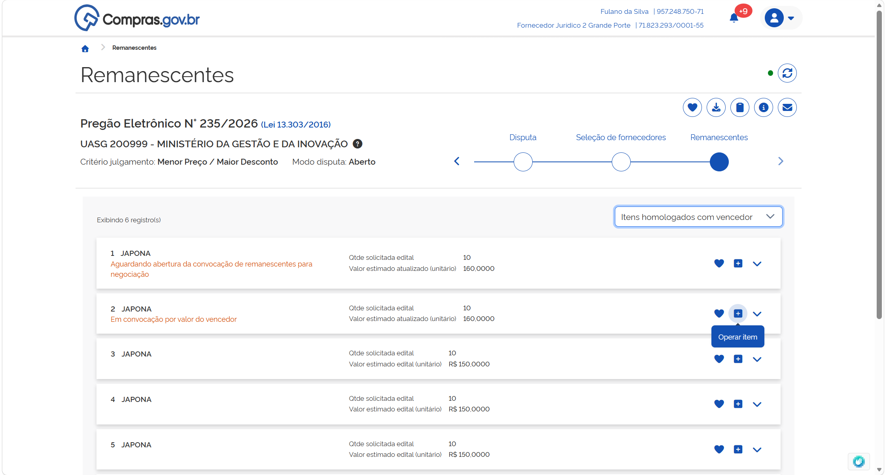
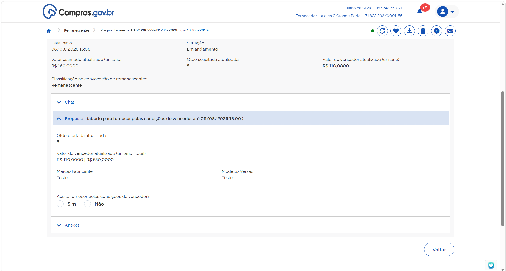

  <button onclick="window.print()" style="background-color: #0056b3; color: white; padding: 10px 20px; border: none; border-radius: 5px; font-size: 16px; cursor: pointer; box-shadow: 0 2px 4px rgba(0,0,0,0.2);">
    🖨️ Imprimir ou baixar esta página
  </button>

# MANIFESTANDO INTERESSE EM PARTICIPAR DE UMA CONVOCAÇÃO DE REMANESCENTES

A convocação de remanescentes acontecerá em duas etapas, sucessivas[cite: 1]:
* Aceite para assumir o contrato pelo mesmo preço do licitante vencedor do processo licitatório[cite: 1];
* Caso a primeira etapa não tenha sucesso, será aberta a possibilidade de aceite para assumir o contrato após negociação de valor, incluindo a possibilidade de manutenção da proposta original do licitante interessado[cite: 1].

**Passo 1:** Para formalizar sua intenção de participar em uma convocação de remanescentes, selecione o item em que deseja atuar e clique em “Operar item”[cite: 1].

**Passo 2:** Leia as informações sobre o item, uma vez que os valores podem sofrer atualizações[cite: 1].

**Passo 3:** No campo “Proposta”, será solicitada a manifestação de interesse em participar da convocação de remanescentes, na condição atual[cite: 1].

  <button onclick="window.print()" style="background-color: #0056b3; color: white; padding: 10px 20px; border: none; border-radius: 5px; font-size: 16px; cursor: pointer; box-shadow: 0 2px 4px rgba(0,0,0,0.2);">
    🖨️ Imprimir ou baixar esta página
  </button>

