

  <button onclick="window.print()" style="background-color: #0056b3; color: white; padding: 10px 20px; border: none; border-radius: 5px; font-size: 16px; cursor: pointer; box-shadow: 0 2px 4px rgba(0,0,0,0.2);">
    🖨️ Imprimir ou baixar esta página
  </button>

# CONVOCAÇÃO POR NEGOCIAÇÃO DE PREÇOS

Caso a primeira etapa não tenha sucesso, será aberta a possibilidade de aceite para assumir o contrato após negociação de valor, incluindo a possibilidade de manutenção da proposta original do licitante interessado[cite: 1].

**Passo 01:** Acesse a contratação com status “Em convocação para negociação”, selecionando o ícone “Operar item”[cite: 1].

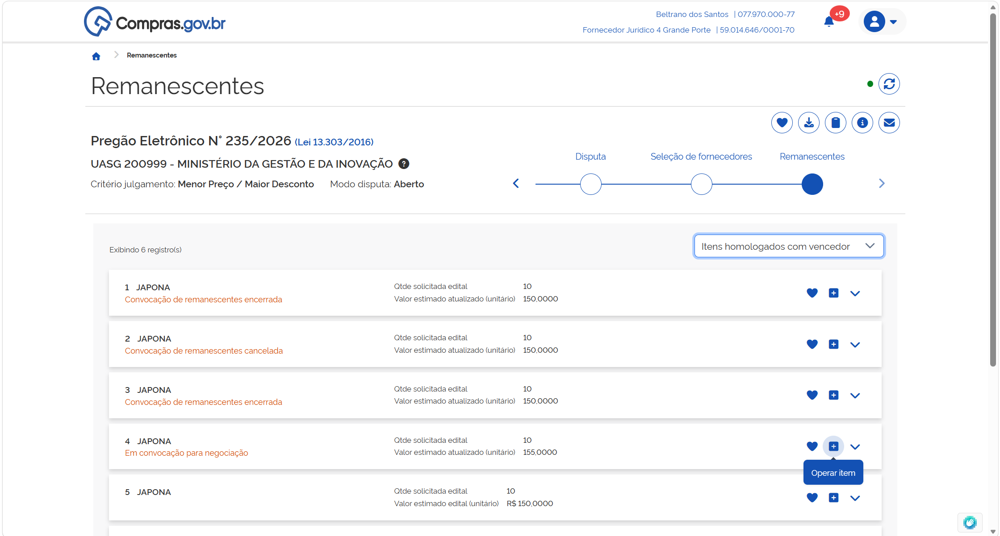

**Passo 02:** No cabeçalho do campo proposta, será indicado o prazo para manifestação de interesse para negociar[cite: 1]. Revise as informações sobre as condições da contratação e selecione a opção desejada[cite: 1]. Confirme sua opção[cite: 1].

*(Nota de sistema: A tela 26 foi incluída para ilustrar o prazo de manifestação).*

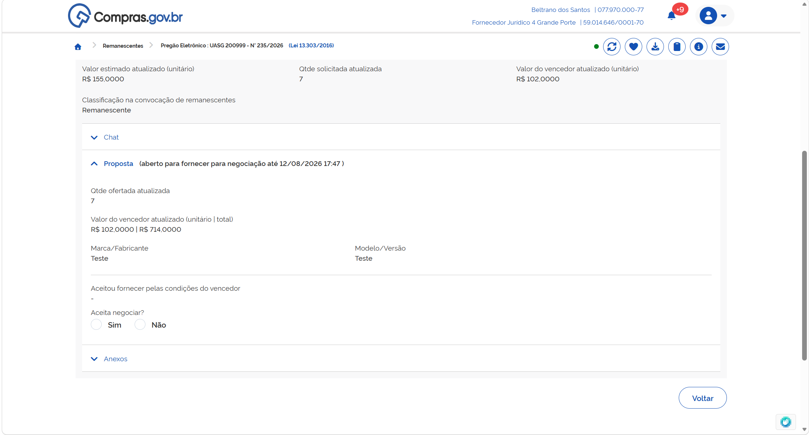

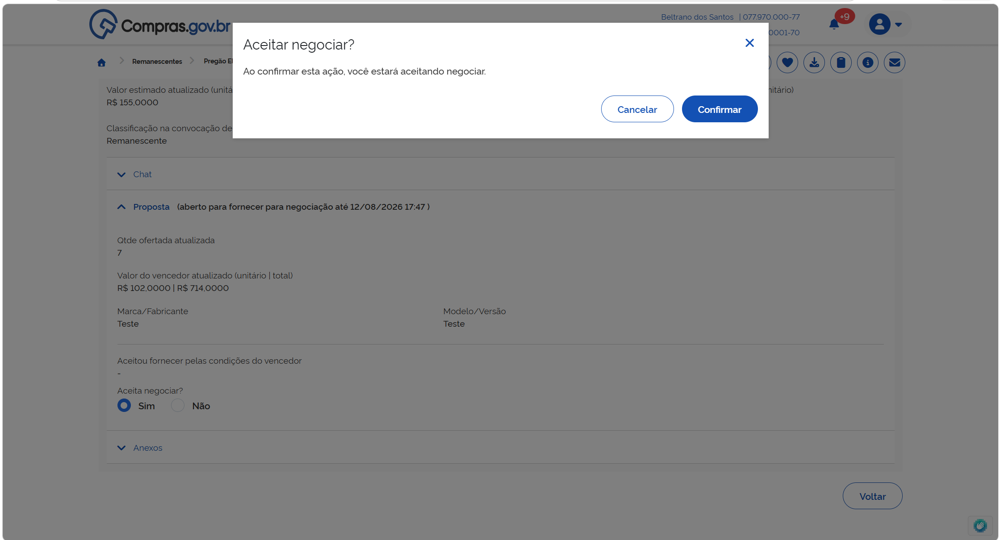

**Passo 03:** Durante o prazo de manifestação indicado, você poderá alterar sua opção[cite: 1]. Selecione a nova opção e confirme a opção[cite: 1].

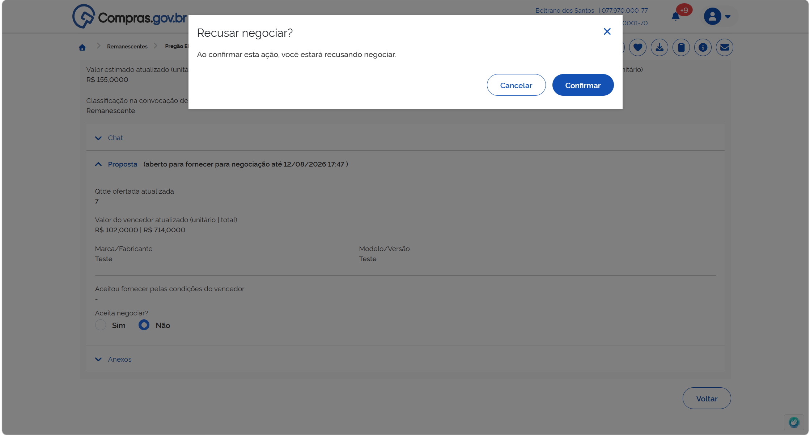

**Passo 04:** Finalizado o prazo para manifestação de todos os fornecedores que participaram do processo, o agente de contratação fará a negociação com o fornecedor mais bem classificado no processo[cite: 1]. 
Retorne ao item em convocação acessando a opção “Operar item”[cite: 1].
Acesse a seção “Proposta” para visualizar os detalhes da negociação[cite: 1].
O valor proposto pela administração aparecerá indicado no campo “Valor sugerido”[cite: 1]. Você poderá “Desistir de participar pelo valor negociado”, “Confirmar o valor negociado”, ou fazer uma contraproposta[cite: 1].

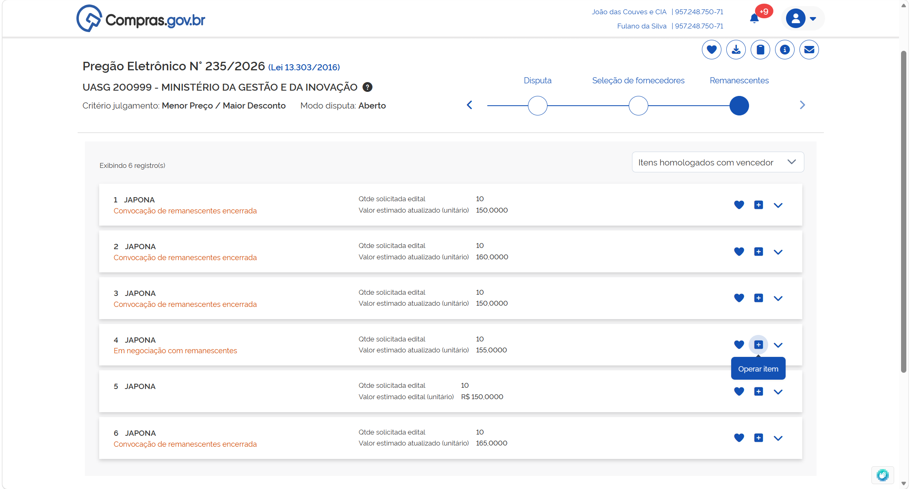

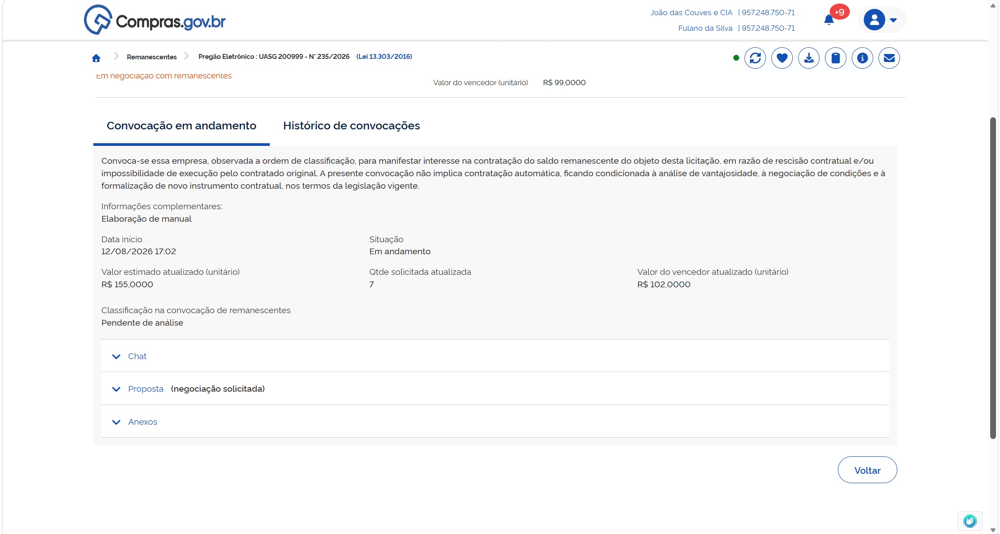

**Passo 05:** Caso não deseje prosseguir no processo, seleciona “Desistir de participar pelo valor negociado”[cite: 1].
Preencha o campo de justificativa e confirme[cite: 1].
Atenção: essa opção não poderá ser desfeita por você, apenas pelo agente de contratação/pregoeiro[cite: 1].

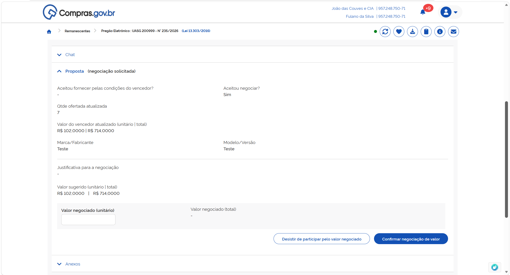

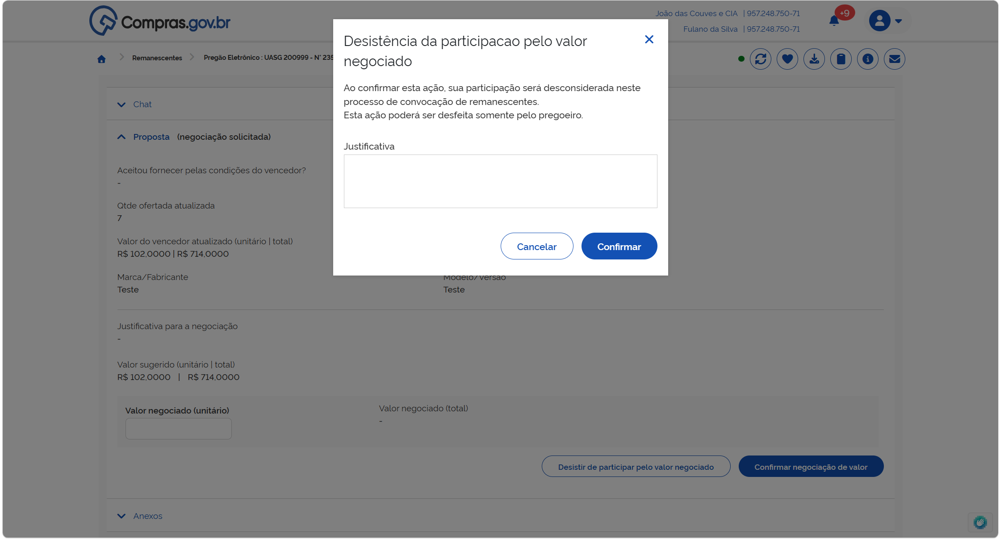

**Passo 06:** Caso deseje aceitar o valor proposto pela Administração, preencha o campo “Valor negociado (unitário)” com o valor proposto pelo agente de contratação/pregoeiro e confirme a opção[cite: 1].

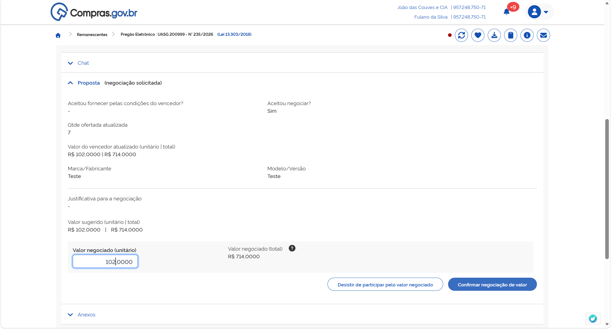

**Passo 07:** Caso deseje fazer uma contraproposta, preencha o campo “Valor negociado (unitário)” com o novo valor proposto e confirma e opção[cite: 1].
O agente de contratação poderá aceitar sua contraproposta ou iniciar uma nova negociação[cite: 1]. Repita esse processo até que cheguem a uma negociação final[cite: 1].

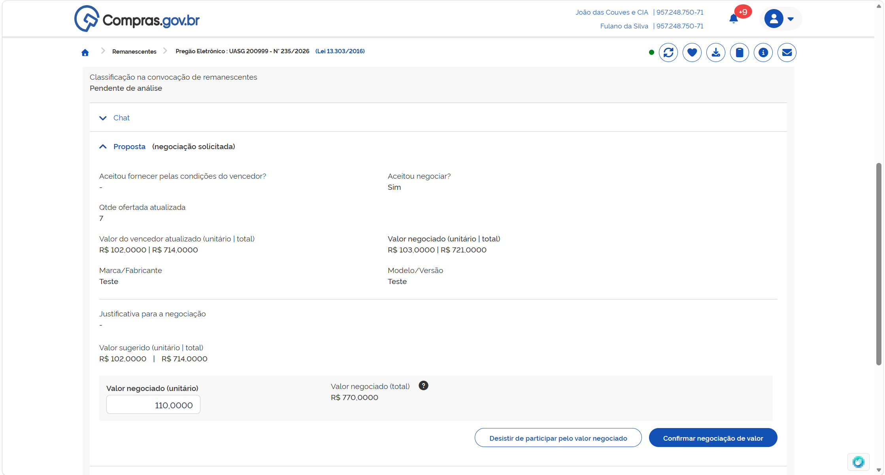

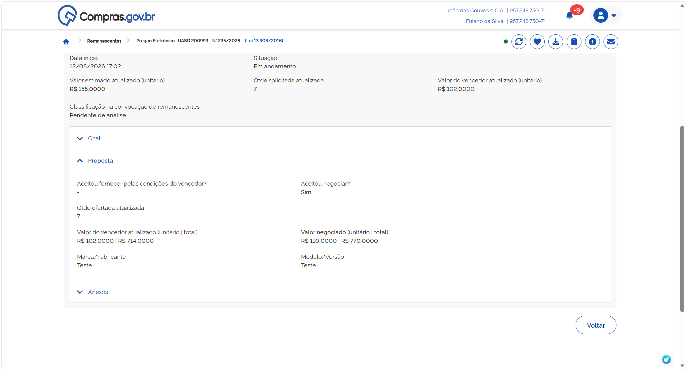

Para envio de documentos solicitados para habilitação e julgamento, siga o passo 3 da seção CONVOCAÇÃO PELAS CONDIÇÕES DO VENCEDOR[cite: 1].
Para envio de mensagens, siga o passo 4 da seção CONVOCAÇÃO PELAS CONDIÇÕES DO VENCEDOR[cite: 1].
Caso o fornecedor seja desclassificado, leia as informações constantes no passo 5 da seção CONVOCAÇÃO PELAS CONDIÇÕES DO VENCEDOR[cite: 1].
Caso o fornecedor seja inabilitado, leia as informações constantes no passo 6 da seção CONVOCAÇÃO PELAS CONDIÇÕES DO VENCEDOR[cite: 1].

**Passo 08:** Caso toda a documentação apresentada esteja de acordo com as exigências de edital, o fornecedor será aceito para fornecimento de remanescente contratual[cite: 1]. Assim, ficará na tela a indicação “Classificação na convocação de remanescente: Aceito e habilitado”[cite: 1].

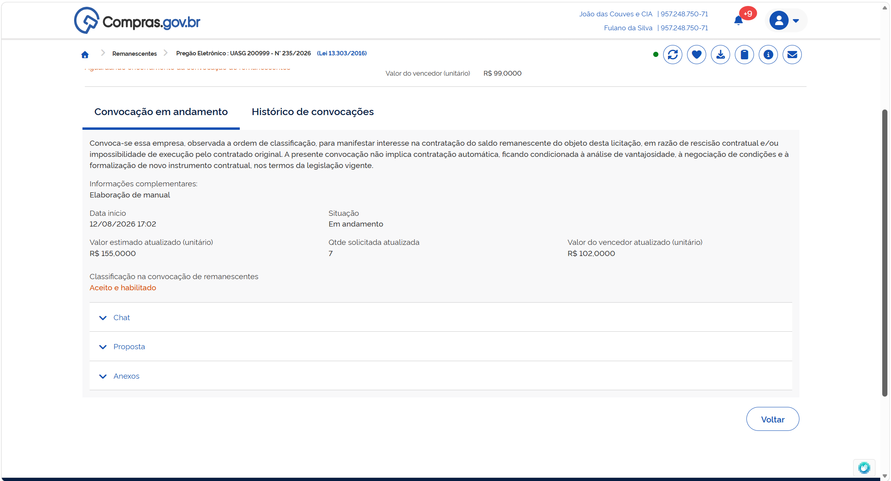

**Passo 09:** Para a formalização do processo, o agente de contratação encerrará a convocação de remanescentes[cite: 1]. Assim, ficará na tela a indicação “Situação: Encerrada”[cite: 1].

  <button onclick="window.print()" style="background-color: #0056b3; color: white; padding: 10px 20px; border: none; border-radius: 5px; font-size: 16px; cursor: pointer; box-shadow: 0 2px 4px rgba(0,0,0,0.2);">
    🖨️ Imprimir ou baixar esta página
  </button>

